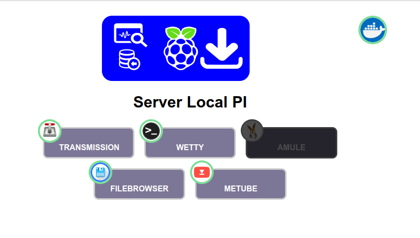

# starpage with manager docker

Se trata de una pagina de inicio para nuestro servidor local o raspberry donde tenemos un menu para el accesso a todos nuestro servicios, donde podemos activar y desactivar servicios con un doble click sobre el icono

Es una simple pagina estática que accede a la api **apidocker** que esta en un servicio paralelo que se carga con el docker compose para manejar los contenedores

el archivo de configuración se encuentra startpage/options

    const port_api = "8888"
    const title = "Server"
    const main_img = "images/title-debian.png"

    const services =[
        {"name":"startpage","port_app":":80/","url_logo":"images/startpage.png"},
        {"name":"ejemplo","port_app":"/","url_logo":"https://github.com/manologcode/posits/blob/master/icon.png?raw=true", "color":"#00ff00" }
    ]

En el array de services podemos añadir todos los servicios que necesitemos, pulsando doble click sobre el icono de docker si esta corriendo apidocker nos dará un listado de todos los contenedores que corren en nuestro servidor en este formato para añadirlo rápidamente.

Para mas info soble api docker: https://github.com/manologcode/apidocker

### instalación

Hay que tener docker y git instalado en el servidor

Clonar el repositorios entra a la carpeta del mismo y ejecutar docker compose

    git clone https://github.com/manologcode/startpage_dockers.git
    cd startpage_dockers
    docker compose up -d

